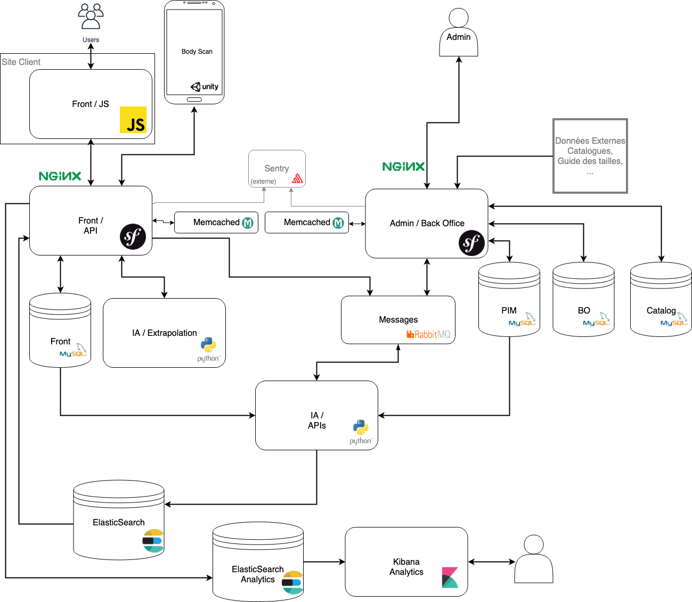

# Asmodine Docker

## Lancement rapide

 - Installer Docker & Docker Compose
 - Dupliquer tous les \*.env.dist à la racine en \*.env et modifier les valeurs si nécéssaires.
 - Dupliquer tous les /container/nginx/\*.conf.dist en /container/nginx/\*.conf et modifier les **server_name** ligne 3.
 - Dupliquer le /config/kibana/kibana.yml.dist en /config/kibana/kibana.yml et modifier les lignes nécessaires.
  - Dupliquer le /config/kibana-analytics/kibana.yml.dist en /config/kibana-analytics/kibana.yml et modifier les lignes nécessaires.
 - Lancer la commande (ajouter **-d** pour la lancer en arrière plan)
 - Générer les certificats SSL Nginx dans /config/nginx/ssl (via https://zerossl.com)
```bash
env $(cat volume.env) docker-compose -f docker-compose-dev.yaml -f docker-compose.yaml up
```
 
